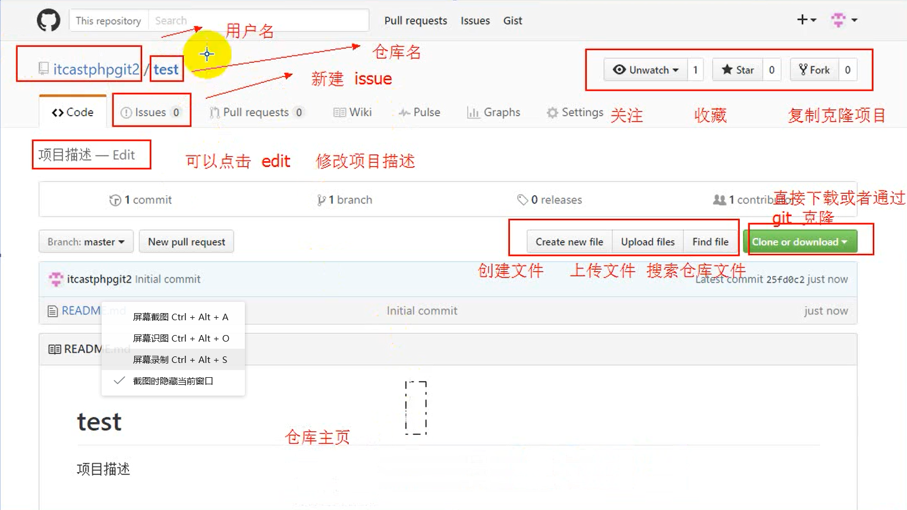
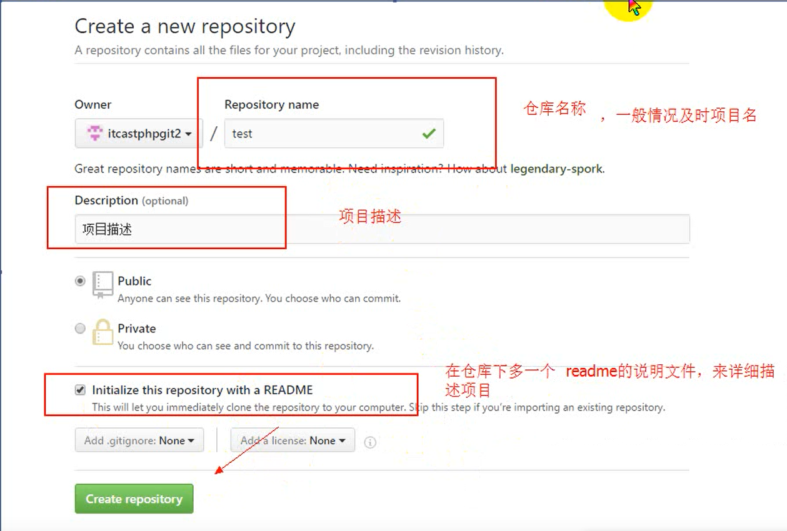
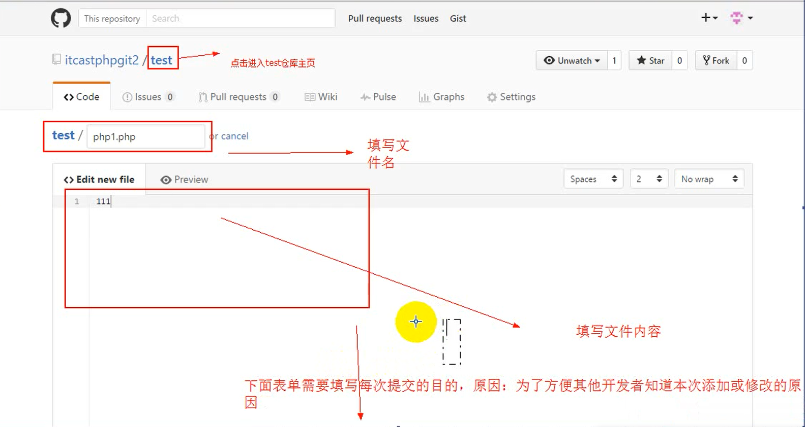
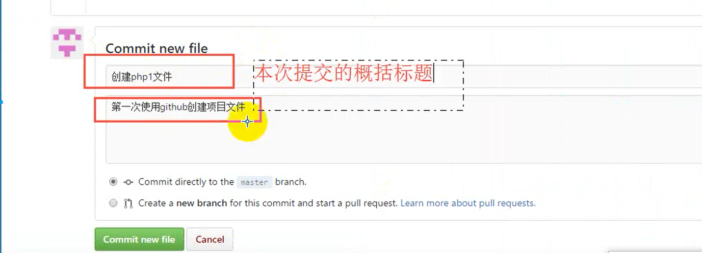
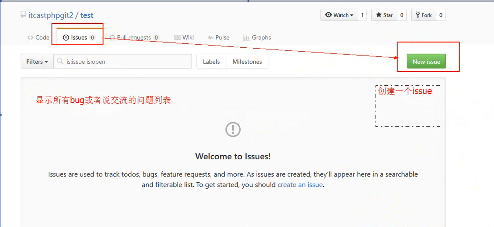
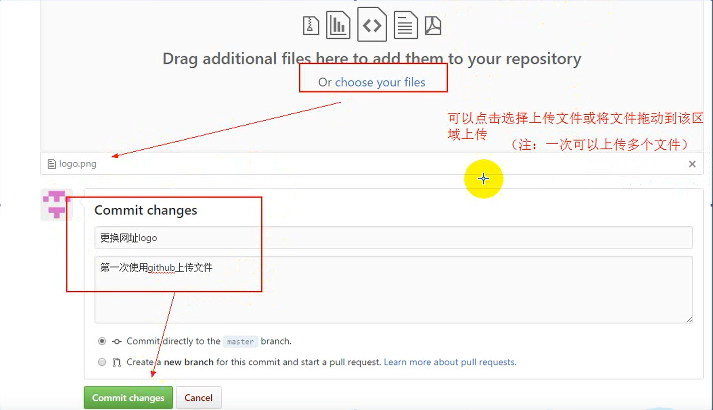
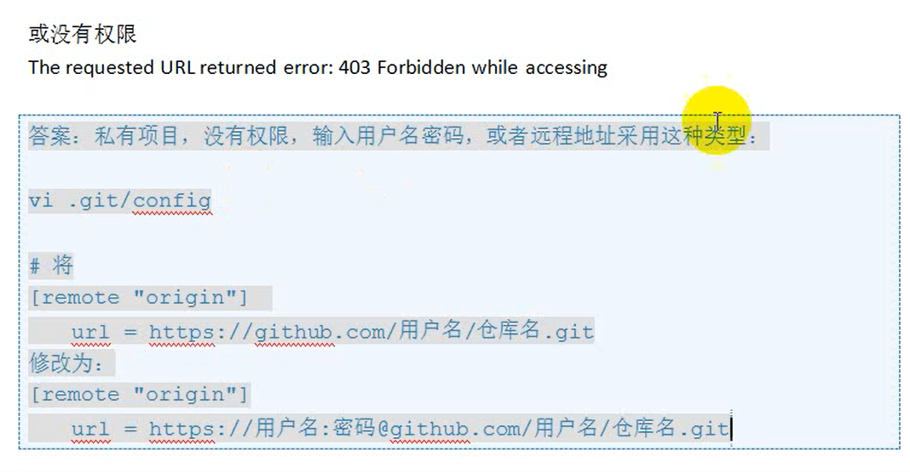

<!-- TOC -->

- [1. GitHub](#1-github)
    - [1.1. 页面](#11-页面)
    - [1.2. 创建项目](#12-创建项目)
    - [1.3. 创建文件](#13-创建文件)
    - [1.4. 修改文件](#14-修改文件)
    - [1.5. issue](#15-issue)
    - [1.6. 上传文件](#16-上传文件)
    - [1.7. 权限提交问题](#17-权限提交问题)
- [2. git](#2-git)
    - [2.1. 机制](#21-机制)
        - [2.1.1. 第一次使用时初始化](#211-第一次使用时初始化)
        - [2.1.2. 新建文件夹](#212-新建文件夹)
        - [2.1.3. 创建初始化git仓库](#213-创建初始化git仓库)
        - [2.1.4. 创建文件](#214-创建文件)
        - [2.1.5. 编辑文件](#215-编辑文件)
        - [2.1.6. 删除文件](#216-删除文件)
        - [2.1.7. 从git中删除文件](#217-从git中删除文件)
        - [2.1.8. 列出当前文件夹所有文件](#218-列出当前文件夹所有文件)
        - [2.1.9. 查看git绑定的用户信息](#219-查看git绑定的用户信息)
        - [2.1.10. 克隆远程仓库文件](#2110-克隆远程仓库文件)
        - [2.1.11. 本地与远程合并](#2111-本地与远程合并)
        - [2.1.12. 将本地仓库提交给远程仓库](#2112-将本地仓库提交给远程仓库)
            - [2.1.12.1. 注意](#21121-注意)
    - [2.2. 修改本地仓库名称](#22-修改本地仓库名称)

<!-- /TOC -->
# 1. GitHub
## 1.1. 页面

repository（仓库）：一个项目一个仓库

star（收藏）

fork（复制克隆）

forked from 

（pull request）发起请求（克隆别人代码后，自己修改后，想加入原作者仓库里面就发起请求）

watch（关注）

issue（事务卡片）

## 1.2. 创建项目

repository name（仓库名） 

description（描述）（在项目列表下面详细描述项目用的）  

勾选：initialize this repositiry  with a README(初始化一个项的README）（在项目中创建一个说明文件）

## 1.3. 创建文件

项目创建完之后点击**create new file**

preview（预览）

comment new file（说明新文件）

第一行是对这个新文件的概括

第二行是详细描述

initial commit(下面显示的是提交文件的说明）

commits（该文档修改的次数）

点击commits可以查看所做的修改，（删除的也能看到）

## 1.4. 修改文件

commit changes（修改之前的说明）

在initial commit点击文件说明，放置鼠标可以看到详细描述 可以看修改的内容

>删除文件也需要提交说明

upload file（上传文件）

find file（搜索文件）快捷键（t）   
*文件多的时候可以使用*

clone or download（打包下载） 

## 1.5. issue 

>&emsp;&emsp;其他人员使用是发现问题，可以通过此方式反馈，相当于讨论区

## 1.6. 上传文件

## 1.7. 权限提交问题

>&emsp;&emsp; ``git push``不能同步到远程仓库时可以更改（未验证）

# 2. git

## 2.1. 机制
>&emsp;&emsp;刚开始写的文件在工作区，使用``git add+文件名.后缀``移交到暂存区，最后通过 ``git commit -m “提交描述说明”``移交到**git 仓库 **

``git status``：显示文件在那个地方（工作区、暂存区、git仓库）

工作区（working directory）->暂存区`` git add （文件名）``
>可以是多个文件 或文件夹 用空格隔开

暂存区->git repository（git 仓库）`` git commit -m “提交描述说明”``

### 2.1.1. 第一次使用时初始化

设置用户名：  
``git config --global use.name ‘tyler-jiao’（name与‘’之间要有空格）``

设置用户名邮箱：  
``git config --global use.email ‘321495417@qq.com’``

>&emsp;&emsp;用户名和邮箱只第一次使用git需要设置，之后除更改外无需设置

### 2.1.2. 新建文件夹
``mkdir 文件夹名``

### 2.1.3. 创建初始化git仓库  
``cd 文件夹名``  
``git init（初始化命令）``

>&emsp;&emsp;cd命令进去文件夹后 git init可以初始化文件夹产生一个.git的隐藏文件夹（记得显示隐藏文件）

### 2.1.4. 创建文件
``touch 文件名（需要加后缀）``

### 2.1.5. 编辑文件
``vi 文件名（需要加后缀）（若不存在自动创建一个）``

### 2.1.6. 删除文件
``rm 文件名（需要加后缀）``

### 2.1.7. 从git中删除文件
``git  rm 文件名（需要加后缀）``

### 2.1.8. 列出当前文件夹所有文件
``ls``

### 2.1.9. 查看git绑定的用户信息
``git config --list``

### 2.1.10. 克隆远程仓库文件
``git clone +GitHub地址（在GitHub项目中点击clone or download即可看到）``

### 2.1.11. 本地与远程合并
``git pull``

### 2.1.12. 将本地仓库提交给远程仓库
``git push``

#### 2.1.12.1. 注意

> 在同步到GitHub之前，需要先将文件上传到git的仓库中，再进行同步到GitHub操作，否则可能出现如下提示

>提交过程中会产生错误提示：  
'warning: LF will be replaced by CRLF in XXXX. The file will have its original line endings in your working directory'
原因：  
windows中的换行符为 CRLF， 而在Linux下的换行符为LF，所以在执行add . 时出现提示
解决方法：  
``git config --global core.autocrlf false``  
false就是不转换符号 默认是true

## 2.2. 修改本地仓库名称

>当修改完远程仓库名后，需要修改本地仓库名称
手动修改文件夹名后，通过git remote -v查看
git仓库名称依然没有修改

可执行``git remote set-url origin url``  
再执行``git remote -v``查看