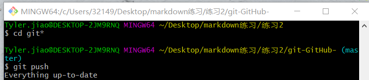

# git报错问题
## git上传到github 方式
- 打开git bash
-  mkdir 文件夹名
- cd 文件夹 
- 输入git init
- git add (filename)
- git commit -m "描述" 
- git remote add origin (url)建立连接
- git push

> 在同步到GitHub之前，需要先将文件上传到git的仓库中，再进行同步到GitHub操作，否则可能出现如下提示



>提交过程中会产生错误提示：  
```
'warning: LF will be replaced by CRLF in XXXX. The file will have its original line endings in your working directory'
```
原因：  
windows中的换行符为 CRLF， 而在Linux下的换行符为LF，所以在执行add . 时出现提示
解决方法：  
``git config --global core.autocrlf false``  
false就是不转换符号 默认是true

## git push 不上去

 git remote add origin (远程仓库url）

然后git push -u origin master

但是这里可能会报错:

```
 ! [rejected]        master -> master (non-fast-forward)
error: failed to push some refs to 'https://github.com/huijuanl/huijuan072.git'
hint: Updates were rejected because the tip of your current branch is behind
hint: its remote counterpart. Integrate the remote changes (e.g.
hint: 'git pull ...') before pushing again.
hint: See the 'Note about fast-forwards' in 'git push --help' for details.
```
这是因为推送代码前需要先从服务器pull最新的代码。

继续输入命令: 
``git pull origin master--allow-unrelated-histories``

**注意**

>这里是允许合并了远程的分支，会跳入vim编辑器，只要按住esc键，同时按两下大写的z就可以退出

继续输入git push -u origin master就成功了。

