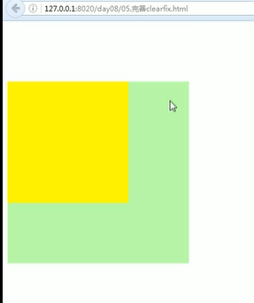
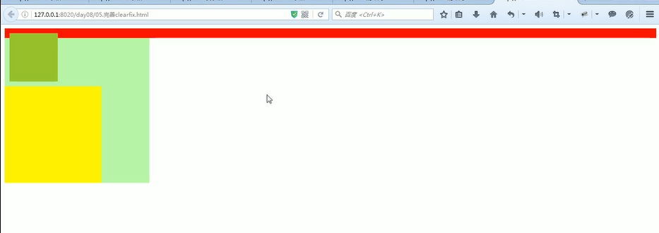
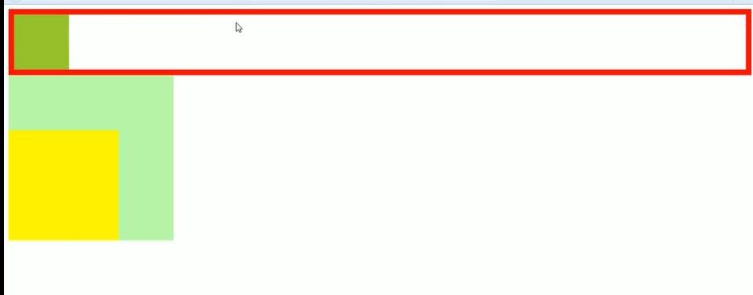
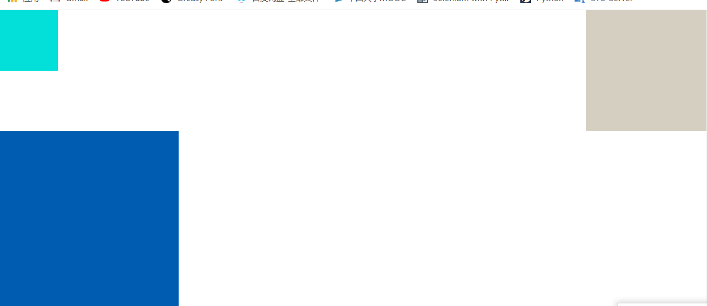

<!-- TOC -->

- [1. html+css笔记总结](#1-htmlcss%e7%ac%94%e8%ae%b0%e6%80%bb%e7%bb%93)
	- [1.1. padding border margin关系](#11-padding-border-margin%e5%85%b3%e7%b3%bb)
	- [1.2. css中标签元素分为块元素和内联元素](#12-css%e4%b8%ad%e6%a0%87%e7%ad%be%e5%85%83%e7%b4%a0%e5%88%86%e4%b8%ba%e5%9d%97%e5%85%83%e7%b4%a0%e5%92%8c%e5%86%85%e8%81%94%e5%85%83%e7%b4%a0)
		- [1.2.1. 块元素](#121-%e5%9d%97%e5%85%83%e7%b4%a0)
		- [1.2.2. 内联元素](#122-%e5%86%85%e8%81%94%e5%85%83%e7%b4%a0)
	- [1.3. display](#13-display)
	- [1.4. tab键有补全代码的功能](#14-tab%e9%94%ae%e6%9c%89%e8%a1%a5%e5%85%a8%e4%bb%a3%e7%a0%81%e7%9a%84%e5%8a%9f%e8%83%bd)
	- [1.5. 正常中所有标签都是会默认在文档流中使用](#15-%e6%ad%a3%e5%b8%b8%e4%b8%ad%e6%89%80%e6%9c%89%e6%a0%87%e7%ad%be%e9%83%bd%e6%98%af%e4%bc%9a%e9%bb%98%e8%ae%a4%e5%9c%a8%e6%96%87%e6%a1%a3%e6%b5%81%e4%b8%ad%e4%bd%bf%e7%94%a8)
	- [1.6. float会使标签脱离文档流](#16-float%e4%bc%9a%e4%bd%bf%e6%a0%87%e7%ad%be%e8%84%b1%e7%a6%bb%e6%96%87%e6%a1%a3%e6%b5%81)
	- [1.7. position（用于定位）](#17-position%e7%94%a8%e4%ba%8e%e5%ae%9a%e4%bd%8d)
	- [1.8. 高度塌陷，外边距重叠（都是在垂直方向）](#18-%e9%ab%98%e5%ba%a6%e5%a1%8c%e9%99%b7%e5%a4%96%e8%be%b9%e8%b7%9d%e9%87%8d%e5%8f%a0%e9%83%bd%e6%98%af%e5%9c%a8%e5%9e%82%e7%9b%b4%e6%96%b9%e5%90%91)
		- [1.8.1. 外边距重叠](#181-%e5%a4%96%e8%be%b9%e8%b7%9d%e9%87%8d%e5%8f%a0)
		- [1.8.2. 高度塌陷](#182-%e9%ab%98%e5%ba%a6%e5%a1%8c%e9%99%b7)
		- [1.8.3. clearfix](#183-clearfix)
	- [1.9. clear](#19-clear)
	- [1.10. margin](#110-margin)
	- [1.11. padding](#111-padding)
	- [1.12. 图片规范](#112-%e5%9b%be%e7%89%87%e8%a7%84%e8%8c%83)
	- [1.13. background](#113-background)
	- [1.14. a标签去下划线](#114-a%e6%a0%87%e7%ad%be%e5%8e%bb%e4%b8%8b%e5%88%92%e7%ba%bf)
	- [1.15. 字体](#115-%e5%ad%97%e4%bd%93)
	- [1.16. table边框问题](#116-table%e8%be%b9%e6%a1%86%e9%97%ae%e9%a2%98)

<!-- /TOC -->

# 1. html+css笔记总结

**一下都是按照本人理解而写（非标准）**

## 1.1. padding border margin关系

>注意：
width height定义用作内容部分


## 1.2. css中标签元素分为块元素和内联元素

### 1.2.1. 块元素

该元素使用后会占用整行内容是一块区域

### 1.2.2. 内联元素

该元素使用后占用页面大小又由自身内容决定（内容撑起的空间）

>例如：div、ul、p h123456等都是块元素 a、span等是内联元素
内联元素不能设置width，height（不会起作用）
其中display属性可以改变元素的类型

## 1.3. display

块元素默认display:block;  
行内非替换元素(a,span)默认为display：inline;  
行内替换元素(input)默认为display:inline-block;

>**a.** display:none;不显示该元素，也不会保留该元素原先占有的文档流位置。  
**b.** display:block;转换为块级元素。  
**c.** display:inline;转换为行内元素。  
**d.** display:inline-block;转换为行内块级元素。

## 1.4. tab键有补全代码的功能
>例如：
div.类名点击tab键会直接产生``<div class="类名"></div>``
div.类名$*3点击tab键会直接产生“类名1”、“类名2”、“类名3”，三个div

## 1.5. 正常中所有标签都是会默认在文档流中使用

但是有些属性会使标签脱离文档流
>如：float、position:absolute、position:fixed但是position:relative不会是标签脱离文档流
属性脱离文档流后，块元素，内联元素都用自己设置的内容支撑起自己页面大小
>>此时内联元素可定义width和hheight

## 1.6. float会使标签脱离文档流
有三个值，none，left，right

不浮动，向左上浮动，向右上浮动  
若浮动，浮动遇到父元素边框或其他文档流块级元素或其他浮动元素会停下  
浮动会使下方元素向上顶（浮动有可能盖住下方元素）

>小技巧：若在一个div中有两个元素左右排列，可以使向右的元素向右浮动，并使向右浮动元素位于向左元素的前面，避免向右元素浮动遇到向左的块级元素，不能继续向右上浮动，导致不能左右平齐

## 1.7. position（用于定位）
有三个常用值：absolute、fixd、relative  

position:relative  
相对位置  
相对位置是相对原位置而言，且该语句单独没有影响  
它会激活top，right，bottom，left  
设置其值后会相对于原图像移动，一般两个元素就够

position:absolute  
绝对定位  
相对定位是相对于窗口而言，且该语句单独没有影响  
它会激活top，right，bottom，left  
>若css中存在相对定位，它会以最近的相对定位为标准来改变其上下左右所以一般绝对定位会配合相对定位来使用，且有子绝父相的说法，来相对于父元素定位子元素位置

## 1.8. 高度塌陷，外边距重叠（都是在垂直方向）
### 1.8.1. 外边距重叠
>当父子元素公用相同的同一个上外边距（中间没有其他元素或内容，父子边框外贴合）  
此时改变子元素的外边距，父元素外边距也会随之改变

图示：



>思路：使父子元素边框外不重叠，添加一个空东西

解决办法（不唯一）：  
```css
.父元素类名:before{
	content:"";
	display:table;
    /* 可将元素设置为一个表格显示，但是内容为空 */
}
```
### 1.8.2. 高度塌陷

>父元素未设置高度，依靠子元素支撑，若子元素设为浮动，脱离文档流，会产生高度塌陷现象

图示：



解决办法（不唯一）：  
```
.父元素类名:after{
	content:"";
	display:block;
	clear:both;(忽略之前的浮动）
}
```
### 1.8.3. clearfix


高度塌陷，外边距重叠，两个问题解决方法合并
```
.clearfix:before,
.clearfix:after{
	content:"";
	display:table;
	clear:both;(忽略之前的浮动）
}
```
## 1.9. clear
作用：忽略之前浮动
有三个常用值：left、right、both  
left：忽略前面向左的浮动  
right：忽略前面想向右的浮动  
both：忽略前面max（左右浮动）值  

（下方图示过程中，有所颜色为更改大小有所更改，方便观察）

未浮动


左浮动时，去除左浮动：



## 1.10. margin

设置外边距有四个方向：  
margin-top  
margin-right  
margin-bottom  
margin-left  
可单独写一个  
margin:0px,0px,0px,0px;(上右下左）  
也可至指定两个值分别为上下和左右  
一个值为就是四个方向  
三个值是上和左右和下  
>注意：
1、当两个模块为上下相邻
上模块设置下外边距，下模块设置上外边距
所得距离不是两者相加而是两者中最大值
2、设置外边距时小心外边距重叠

## 1.11. padding

设置内边距和外边距设置方法基本相同  
>注意：若元素为设置边距或设置为auto，此时设置内边距，不会使内容溢出或改变内容高度和宽度会自动改变
>>文档流中，当元素的高度或宽度设为auto或不设置时，改变padding不会改变可见框的大小，w,h会自动调整

## 1.12. 图片规范

背景图片整理成为一张图片，可减小图片大小   
>用background-position放置图片位置（可用left、right、top、bottom、center五个方位中的两个或用两个px）  

>可用background来指定、背景颜色、背景图片、图片位置、是否拉伸平铺也可单独指定方位

## 1.13. background
background (background-color, background-image)    
背景色覆盖范围: border+ width+ padding ;  
背景图覆盖范围: width + padding ;  

## 1.14. a标签去下划线
text-decoration:none;

## 1.15. 字体
字体设置front:字号/行高 字体  
字体的颜色单独用color设置   
行高也可单独指定：line-height  
缩进text-indent: 1em;(em为一个字体大小）

## 1.16. table边框问题

```html 
<table>
	<tr>
		<th></th>
	</tr>
	<tr>
		<td></td>
	</tr>
       </table>
 ```
```css
  table{
      margin:o auto;
      border:1px solid black;
      border-spacing:0px;
      /* table与th，td之间有一段距离，通过这个设置距离 */
      border-collapse:collapse;
      /* 表格的边框合并（两条变一条） */
}
```